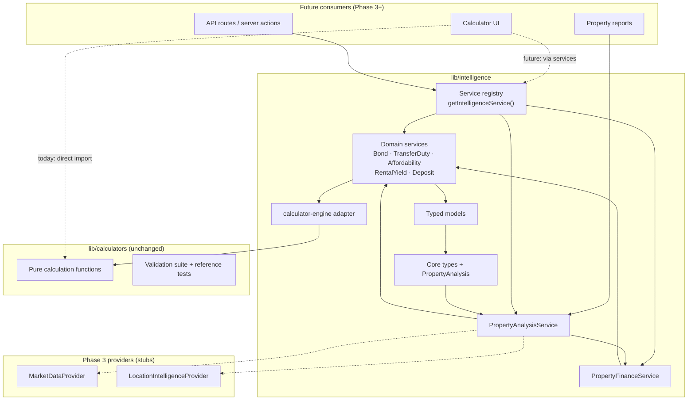
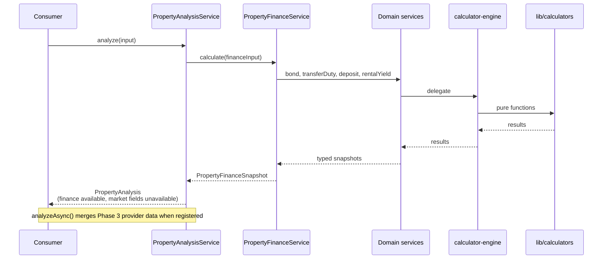

# PropertyPilot Intelligence Layer — Architecture

Phase 2 introduces an internal services layer that transforms PropertyPilot from an information website into a property intelligence platform. **No UI changes** — existing calculators continue to import from `lib/calculators/` unchanged.

## Architecture Diagram



### Data flow — PropertyAnalysis



## Folder Structure

```
lib/intelligence/
├── ARCHITECTURE.md              # This document
├── index.ts                     # Public barrel export
├── core/
│   ├── types.ts                 # ServiceId, CalculationService, AnalysisField, etc.
│   ├── property-analysis.ts     # PropertyAnalysis interface + UNAVAILABLE_REASON
│   └── index.ts
├── models/
│   ├── bond.model.ts
│   ├── transfer-duty.model.ts
│   ├── affordability.model.ts
│   ├── rental-yield.model.ts
│   ├── deposit.model.ts
│   ├── property-finance.model.ts
│   └── index.ts
├── providers/
│   ├── calculator-engine.ts     # Single adapter to lib/calculators
│   └── index.ts
├── services/
│   ├── bond.service.ts
│   ├── transfer-duty.service.ts
│   ├── affordability.service.ts
│   ├── rental-yield.service.ts
│   ├── deposit.service.ts
│   ├── property-finance.service.ts   # Orchestrator
│   ├── property-analysis.service.ts  # Top-level intelligence entry
│   └── index.ts                        # Registry + getIntelligenceService()
└── __tests__/
    └── services.test.ts                # Parity + composition tests
```

## Service Contracts

| Service | ID | Input model | Output |
|---------|-----|-------------|--------|
| `BondService` | `bond` | `BondCalculationInput` | `BondResult` |
| `TransferDutyService` | `transfer-duty` | `{ purchasePrice }` | duty amount or breakdown |
| `AffordabilityService` | `affordability` | `AffordabilityInput` | `AffordabilityResult` |
| `RentalYieldService` | `rental-yield` | `RentalYieldInput` | `RentalYieldResult` |
| `DepositService` | `deposit` | `DepositInput` | `DepositResult` |
| `PropertyFinanceService` | `property-finance` | `PropertyFinanceInput` | `PropertyFinanceSnapshot` |
| `PropertyAnalysisService` | `property-analysis` | `PropertyAnalysisInput` | `PropertyAnalysis` |

All calculation services implement `CalculationService<TInput, TOutput>`:

```typescript
type CalculationService<TInput, TOutput> = {
  readonly id: ServiceId;
  calculate(input: TInput): TOutput;
};
```

## PropertyAnalysis Interface

`PropertyAnalysis` is the unified output for future property intelligence tools. Each non-finance field uses `AnalysisField<T>` so consumers distinguish **available**, **partial**, and **unavailable** data:

```typescript
type AnalysisField<T> = {
  status: "available" | "partial" | "unavailable";
  value?: T;
  reason?: string;
};
```

| Field | Phase 2 status | Source |
|-------|----------------|--------|
| `finance` | Always available | `PropertyFinanceService` |
| `monthlyOwnershipCost` | Available | Derived from finance snapshot |
| `rentalEstimate` | Available when `monthlyRent` provided | `RentalYieldService` |
| `estimatedValue` | Unavailable | Requires `MarketDataProvider` |
| `offerRecommendation` | Unavailable | Requires offer engine (Phase 3) |
| `investmentScore` | Unavailable | Requires market + rental datasets |
| `riskScore` | Unavailable | Requires crime + volatility data |
| `futureGrowthIndicators` | Unavailable | Requires price trend data |
| `schoolProximity` | Unavailable | Requires geospatial provider |
| `transport` | Unavailable | Requires routing provider |
| `crimeIndicators` | Unavailable | Requires crime data feed |

## Migration Plan

Migration is **incremental** — existing calculators and UI are not touched in Phase 2.

### Phase 2 (complete) — Foundation

- [x] Create `lib/intelligence/` with typed models, services, and registry
- [x] Adapter pattern: services delegate to `lib/calculators` via `calculator-engine.ts`
- [x] Parity tests confirm service output matches direct calculator calls
- [x] `PropertyAnalysisService` stub with `analyze()` and `analyzeAsync()` entry points
- [x] Provider interfaces defined but not implemented

### Phase 3 — Data providers

1. Implement `MarketDataProvider` (estimated value, comparables)
2. Implement `LocationIntelligenceProvider` (schools, transport, crime)
3. Wire providers via `createPropertyAnalysisService({ marketData, locationIntelligence })`
4. Add offer recommendation engine consuming finance + market data
5. Add investment/risk scoring modules

### Phase 4 — Consumer migration

1. Update calculator UI components to call services instead of `lib/calculators` directly
2. Add server actions or API routes that expose `PropertyAnalysisService.analyzeAsync()`
3. Keep `lib/calculators` as the calculation source of truth until Phase 5

### Phase 5 — Logic consolidation (optional)

1. Move calculation implementations from `lib/calculators/` into service classes or a shared `engine/` module
2. Re-export from `lib/calculators/` for backward compatibility (deprecated shim)
3. Remove shim once all consumers migrated

### Migration safety rules

- **Never change calculator function signatures** during Phases 2–4
- **Parity tests** must pass before any consumer switches to services
- **One calculator at a time** when migrating UI (lowest risk: bond, transfer duty)
- Existing validation suite (`lib/calculators/validation/`) remains the regression gate

## Future Extension Points

### 1. Provider injection (Phase 3)

```typescript
const analysis = createPropertyAnalysisService({
  marketData: myMarketProvider,
  locationIntelligence: myLocationProvider,
});

await analysis.analyzeAsync({ propertyPrice: 2_000_000, location: { suburbSlug: "sandton" } });
```

### 2. Service registry

```typescript
import { getIntelligenceService } from "@/lib/intelligence";

const bond = getIntelligenceService("bond").calculate({ loanAmount, annualRatePercent, termYears });
```

Enables dynamic tool routing (e.g. calculator registry maps slug → service ID).

### 3. New domain services

Follow the established pattern:

1. Add input/output models in `models/`
2. Create service class implementing `CalculationService`
3. Delegate to `calculatorEngine` (or inline logic in Phase 5)
4. Register in `services/index.ts` with a new `ServiceId`
5. Add parity test against existing calculator

Candidates: `IncomeTaxService`, `CapitalGainsTaxService`, `RentVsBuyService`, `InflationService`.

### 4. Composed services

`PropertyFinanceService` demonstrates orchestration — future `InvestmentAnalysisService` could compose finance + rental yield + tax + CGT.

### 5. Async analysis pipeline

`PropertyAnalysisService.analyzeAsync()` uses `Promise.all` for independent provider calls. Future scoring engines can be added as additional parallel fetches.

## Performance Considerations

| Concern | Approach |
|---------|----------|
| **Calculation cost** | All services are synchronous pure functions — sub-millisecond per call. No I/O in Phase 2. |
| **Adapter overhead** | Thin wrapper around existing functions; negligible vs. calculation itself. |
| **Composition** | `PropertyFinanceService` calls 3–4 sub-services sequentially. Still O(1) for typical inputs. |
| **Async providers** | Phase 3 providers should use `Promise.all` (already in `analyzeAsync`). Set per-provider timeouts. |
| **Caching** | Cache provider responses by `(locationSlug, asOfDate)` at the route/action layer, not inside services. Services stay stateless. |
| **Bundle size** | Tree-shakeable barrel exports. UI migration should import specific services, not the full registry, until needed. |
| **Server vs client** | Services have no React/browser deps — safe for server actions, edge, and client-side use. |

## Testing Strategy

### Layer 1 — Calculator regression (existing)

`lib/calculators/**/*.test.ts` + validation suite — **235 tests**, unchanged. This remains the source of truth for numerical correctness.

### Layer 2 — Service parity (Phase 2)

`lib/intelligence/__tests__/services.test.ts`:

- Each domain service output **deep-equals** direct `lib/calculators` call
- Uses shared reference fixtures from `lib/calculators/__fixtures__/reference-values.ts`
- `PropertyFinanceService` composition test verifies loan, duty, deposit, and ownership cost
- `PropertyAnalysisService` verifies available vs unavailable field statuses

### Layer 3 — Integration (future)

When UI migrates to services:

- End-to-end tests: UI input → service → displayed output matches current snapshots
- Cross-service consistency (already partially covered in `lib/calculators/integration.test.ts`)

### Layer 4 — Provider mocks (Phase 3)

- Mock `MarketDataProvider` and `LocationIntelligenceProvider` in unit tests
- Test `analyzeAsync()` merge logic independently of external APIs
- Contract tests against real provider responses (recorded fixtures)

### Running tests

```bash
npm test                                    # all tests including intelligence
npm test -- lib/intelligence/__tests__/   # intelligence only
npm run build                               # TypeScript + Next.js compile check
```

## Public API

Import from the barrel:

```typescript
import {
  bondService,
  propertyFinanceService,
  propertyAnalysisService,
  getIntelligenceService,
  type PropertyAnalysis,
  type PropertyAnalysisInput,
} from "@/lib/intelligence";
```

Existing calculator imports remain valid:

```typescript
import { calculateBond } from "@/lib/calculators/bond"; // still works
```
